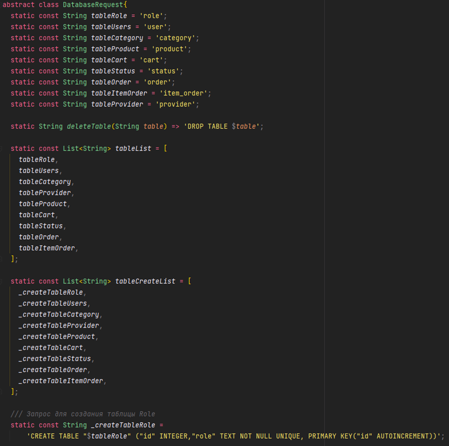
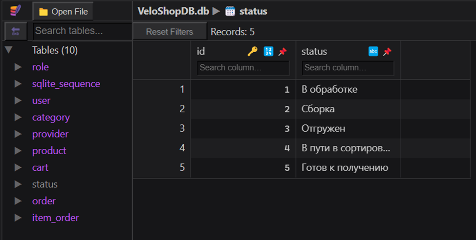

# Практическая работа №2

## Тема: Реализация таблиц и функций базы данных

### Цель работы: в ходе выполнения практической работы реализовать класс, отвечающий за базу данных, таблицы для предметной области "Магазин велосипедов".

### Ход работы:

__1. Создание класса для работы с таблицами__
    
   Данный класс юудет содержать названия всех таблиц и строки-запросы на создание даннхы таблиц.



__2. Создание класса для работы с базой данных__
    
   Для начала мы создадим класс, в котором мы добавим функции для работы с бд.
    
2.1. `Init()`

   В данном методе будет происходить инициализация и создание базы данных.

2.2. `onCreateTable(Database db)`

   Данный метод будет создавать таблицы, запросы на создание каоторых указаны в списке `tableCreateList`, указанном в прошломпункте.
```dart
Future<void> onCreateTable(Database db) async {
    for (var tableCreateString in DatabaseRequest.tableCreateList) {
      await db.execute(tableCreateString);
    }
    await onInitTable(db);
  }
```
  
2.3. `onInitTable(Database db)`
    
Данный метод вызывается сразу после создания таблиц, и нужен для того, чтобы сразу после создания таблиц заполнить __*статические*__ таблицы неизменяемыми данными.

```dart
Future<void> onInitTable(Database db) async {
    try {
      for (var role in RoleEnum.values) {
        db.insert(DatabaseRequest.tableRole, Role(role: role.name).toMap());
      }

      for(var status in StatusEnum.values){
        db.insert(DatabaseRequest.tableStatus, Status(status: status.name).toMap());
      }

      for(var category in CategoryEnum.values){
        db.insert(DatabaseRequest.tableCategory, Category(category: category.name).toMap());
      }

      db.insert(
          DatabaseRequest.tableUsers,
          User(
            login: 'admin',
            password: 'admin',
            idRole: RoleEnum.admin,
          ).toMap());
    } on DatabaseException catch (error) {
      print(error.result);
    }
  }
```

2.4. `onUpdateTable(Database db)`

  Данный метод нужен дляобновления таблиц. В нем мы просто удаляем старые таблицы и запускаем метод создания таблиц.

```dart
Future<void> onUpdateTable(Database db) async {
    var tables = await db.rawQuery('Select name from sqlite_master');
    for (var table in DatabaseRequest.tableList.reversed) {
      if (tables.where((element) => element['name'] == table).isNotEmpty) {
        await db.execute(DatabaseRequest.deleteTable(table));
      }
    }

    await onCreateTable(db);
  }
```

2.5. `onDropDatabase()`

Данный метод нужен для удаления базы данных.
```dart
Future<void> onDropDatabase() async {
    database.close();

    if (Platform.isLinux || Platform.isWindows || Platform.isMacOS) {
      sqfliteFfiInit();
      databaseFactoryFfi.deleteDatabase(_pathDB);
    } else {
      deleteDatabase(_pathDB);
    }
  }
```

__3. Реализация таблиц__

В пункте 1 мы уже сделали класс с названиями таблиц и строками-запросами на их создание. 
Теперь нужнокаждую из 9 таблиц реалиховать в программе. Для примера возьмем таблицу с товарами.

В папку `domain/entity/` добавим файл `product.dart` и в нем добавим конструктор класса `ProductEntity` и поля, 
которые мы указали в строке-запросе на создание таблицы.

В папке `data/model/` добавим файл `product.dart`. В нем мы создадим класс, который будет наследоваться 
от класса `ProductEntity` и реализуем два метода:

- `toMap()` - преобразует модель `Product` в тип `Map<String, dynamic>` 
- `Product.fromToMap(Map<String,dynamic> json)` - преобразует из типа `Map<String, dynamic>` в экземпляр класса `Product`

По такому примеру сделаем остальные 8 таблиц.

__4. Запуск приложения и создание файла базы данных__

Для того, чтобы запустить метод `init()` нужно в файле `main.dart` написать следующие строки:
```dart
void main() {
  WidgetsFlutterBinding.ensureInitialized();
  DatabaseHelper().init();
  runApp(const MyApp());
}
```
В итоге у нас создался файл `VeloShopDB.db`. Теперь откроем его и посмотрим, какие данные там записаны.



Как видно нарисунке выше, были успешно созданы 9 таблиц и статические таблицы были заполнены данными.

### Вывод: в ходе выполнения практической работы были реализованы класс, отвечающий за базу данных, таблицы для предметной области "Магазин велоссипедов"".